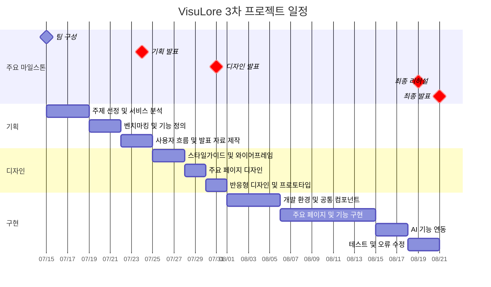

### 1. 프로젝트 개요

과정명 : 프론트엔드 13기
기간 : 2026/04/07 ~ 2026/08/21
3차 프로젝트 (2026/07/15 ~ 2026/08/21) VisuLore : AI를 활용해 사용자가 자신만의 세계관과 캐릭터를 생성하고 관리할 수 있는 아카이빙 서비스를 기획

### 2 👥 팀원

| 이름   | 역할 | 주요 담당 | GitHub                            | 연락                    |
| ------ | ---- | --------- | --------------------------------- | ----------------------- |
| 조승아 | 팀장 |           | https://github.com/eodrn7021-cell | eodrn7021@gmail.com     |
| 장진혁 | 팀원 |           | https://github.com/wwg98          | wwwg98@gmail.com        |
| 이채연 | 팀원 |           | https://github.com/codus69        | lcy0269@gmail.com       |
| 박채원 | 팀원 |           | https://github.com/chaewon5205    | parkjihae9262@gmail.com |

### 3 🗓️ 마일스톤

#### 1주차 — 주제 선정 및 기획

- [x] 팀 구성 및 역할 분담
- [x] 프로젝트 주제 선정
- [x] 서비스 목표와 핵심 사용자 정의
- [x] 기존 서비스 문제점 분석
- [x] 레퍼런스 조사 및 벤치마킹
- [x] 핵심 기능과 MVP 범위 정의
- [x] 정보 구조 및 사용자 흐름 작성
- [x] 기획 발표 자료 제작
- [x] 기획 발표 및 피드백 정리

#### 2주차 — UI/UX 디자인 및 프로토타입

- [x] 디자인 콘셉트 및 컬러 시스템 설정
- [x] 타이포그래피와 그리드 시스템 정의
- [x] 공통 컴포넌트 설계
- [x] PC 메인 페이지 디자인
- [x] 태블릿·모바일 반응형 디자인
- [x] 캐릭터 목록 및 상세 페이지 디자인
- [x] 캐릭터 생성 페이지 디자인
- [x] 로그인·회원가입 페이지 디자인
- [x] 마이페이지 디자인
- [x] 프로토타입 연결
- [x] 디자인 발표 및 피드백 반영

#### 3주차 — 개발 환경 및 공통 구조 구현

- [ ] GitHub 협업 환경 설정
- [ ] 브랜치·커밋·PR 규칙 정리
- [ ] React·TypeScript 프로젝트 환경 구성
- [ ] 폴더 구조 및 파일 네이밍 규칙 확정
- [ ] 라우터와 공통 레이아웃 구성
- [ ] 헤더·사이드바·모바일 하단 바 구현
- [ ] 공통 버튼·입력창·태그 컴포넌트 제작
- [ ] 공통 카드 컴포넌트 제작
- [ ] 반응형 기본 스타일 적용

#### 4주차 — 주요 페이지 및 기능 구현

- [ ] 메인 페이지 구현
- [ ] 추천 캐릭터 슬라이드 구현
- [ ] 카테고리 및 인기 스토리 렌더링
- [ ] 캐릭터 목록 및 상세 페이지 구현
- [ ] 검색·태그·필터 기능 구현
- [ ] 캐릭터 생성·수정·삭제 기능 구현
- [ ] 로그인·회원가입 기능 구현
- [ ] 마이페이지 및 캐릭터 관리 기능 구현
- [ ] 데이터베이스 연동

#### 5주차 — AI 기능 및 최종 점검

- [ ] AI 소개 문장 및 태그 생성
- [ ] AI 이미지 생성 기능 구현
- [ ] 생성 결과 저장 및 캐릭터 적용
- [ ] 반응형 화면 최종 검수
- [ ] 웹 접근성 기본 점검
- [ ] 기능 및 오류 테스트
- [ ] 코드 리팩토링
- [ ] README.md 최종 정리
- [ ] 배포 및 시연 준비
- [ ] 최종 리허설
- [ ] 최종 발표

